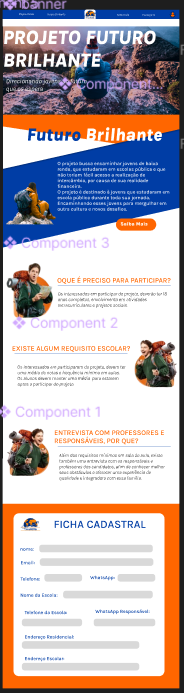
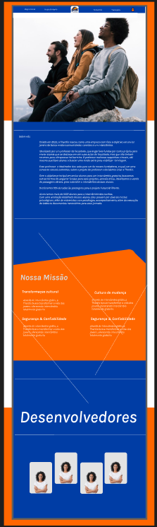
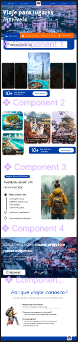
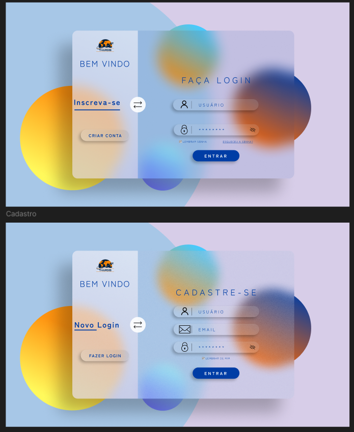

# Thardis 

# Este projeto faz parte do TCC do Instituto da Oportunidade Social.

### O tema do projeto deve abordar algumas das bandeiras das ODS *(Objetivos de Desenvolvimento Sustentável)*. 
### O objetivo central do nosso projeto é oferecer intercâmbio gratuito para todas as crianças de escola pública e de baixa renda, que se enquadrem dentro dos requisitos do projeto.

### O projeto visa proporcionar para crianças de baixa renda que talvez nunca sonhariam em viajar para fora do país, devido a sua realidade econômica.  10% de todas as vendas de passagens aéreas que realizarmos no site, será destinada para o financiamento  deste projeto. Além disso, buscamos diariamente parcerias privadas afim de garantir um intercâmbio de qualidade para todos os jovens. 

### A propósta do IOS é fornecer aos alunos uma vivência real de um ambiente de desenvolvimento. Onde somos encorajados a desenvolver toda parte de documentação do projeto tais como: LEVANTAMENTO DE REQUISITOS, ANALISE FOFA, MISSÃO, VISÃO E VALORES, PÚBLICO ALVO E ETC. Além da parte de documentação, devemos utilizar metodologia Ágeis no desenvolvimento (scrum), protótipagem de layout (figma). Aplicando todo conhecinento adquirido em sala de aula como HTML5, CSS, Git e Github, JavaScript e Bootstrap. Ficando livre para implementar o projeto com mais tecnologías do jeito que achar melhor.  

<!-- # ENVOLVIDOS NO PROJETO :  -->

# Protótipo do figma 

   