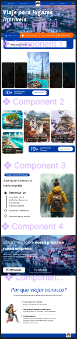
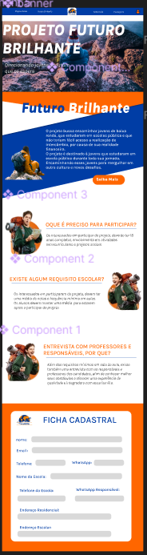
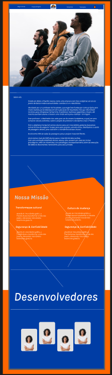
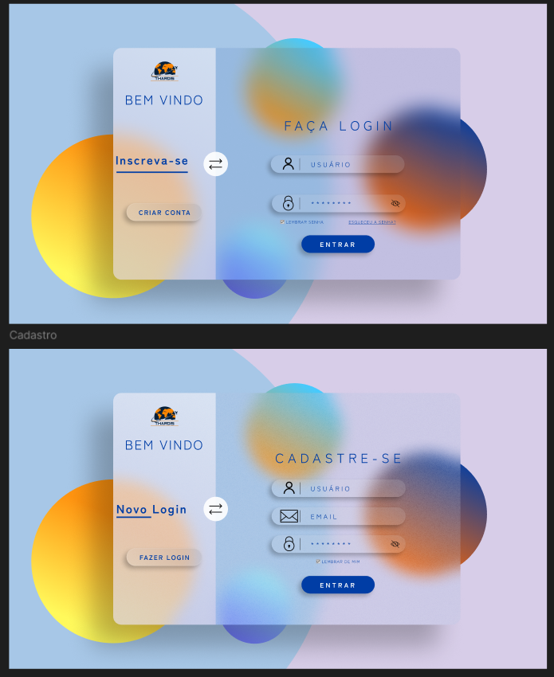

# Thardis  

# Projeto TCC - Instituto da Oportunidade Social

## 🌍 Sobre o Projeto

Este projeto faz parte do Trabalho de Conclusão de Curso do **Instituto da Oportunidade Social (IOS)** e tem como objetivo central abordar algumas das bandeiras das **ODS (Objetivos de Desenvolvimento Sustentável)**.  

### 🎯 Objetivo Central
O projeto tem como missão oferecer **intercâmbio gratuito** para crianças de escolas públicas e de baixa renda, que atendam aos requisitos estabelecidos. Buscamos proporcionar oportunidades para jovens que, devido à sua realidade econômica, talvez nunca sonhariam em viajar para o exterior.  

### 💡 Nosso Propósito
- **10% de todas as vendas** de passagens aéreas realizadas no site serão destinadas ao financiamento deste projeto.  
- Buscamos **parcerias privadas** para garantir intercâmbios de qualidade para todos os jovens participantes.  

---

## 📋 Processo de Desenvolvimento no IOS

O Instituto da Oportunidade Social incentiva os alunos a vivenciarem um ambiente de desenvolvimento real. Somos desafiados a criar um projeto completo, incluindo:  
- **Documentação do Projeto:**  
  - Levantamento de Requisitos  
  - Análise SWOT (FOFA)  
  - Missão, Visão e Valores  
  - Definição do Público-Alvo  
  - E muito mais.  
- **Metodologias Ágeis:**  
  - Uso de Scrum para o gerenciamento do projeto.  
- **Protótipos e Layouts:**  
  - Desenvolvimento no Figma para prototipagem.  
- **Tecnologias Utilizadas:**  
  - HTML5, CSS3, Git, GitHub, JavaScript e Bootstrap.  
  - Liberdade para implementar com tecnologias adicionais conforme a necessidade.  

---

## 🎨 Protótipo no Figma

### Tela Inicial do Protótipo

### Tela do Projeto

### Tela de Sobre Nós

### Tela de Login

---
## 👥 Equipe Envolvida

- **Integrante 1**  
    ](assets/IMG/sobreNos-IMG/Caio.jpeg)
- **Integrante 2**  
   ](assets/IMG/sobreNos-IMG/nicolas.jpeg)
<!-- - **Integrante 3**  
    
- **Integrante 4**  
     -->

--- -->

